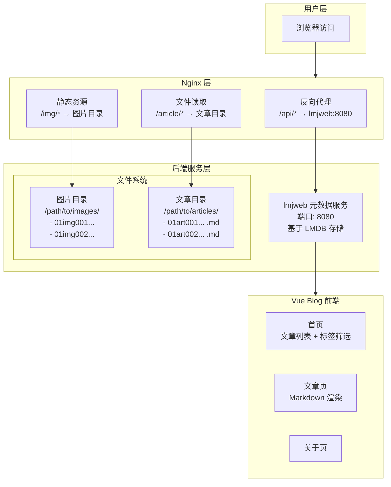
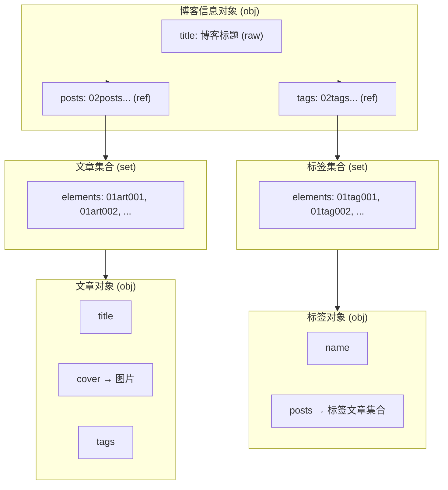
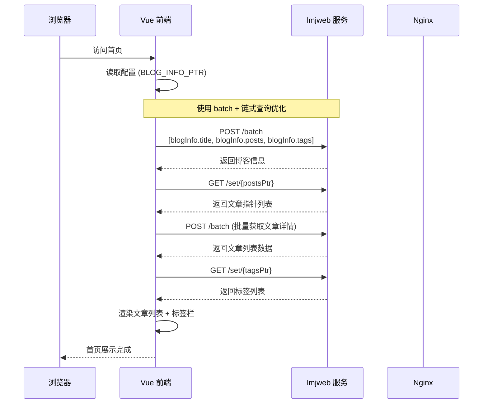
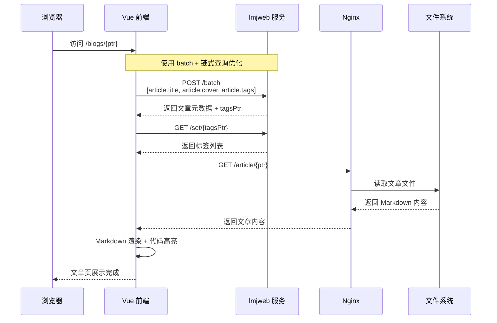
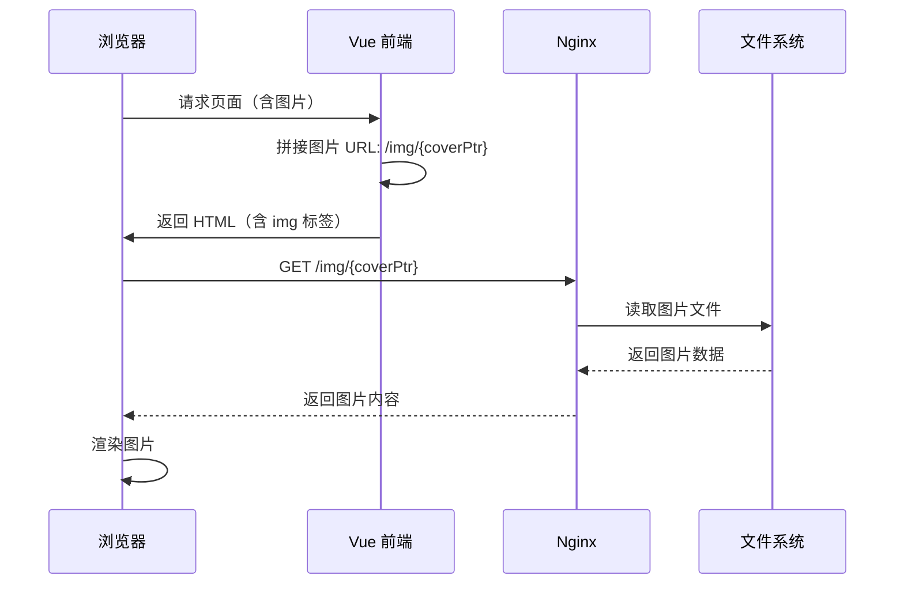
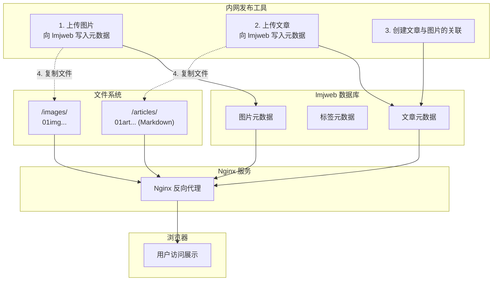
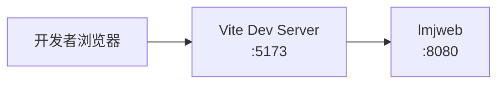
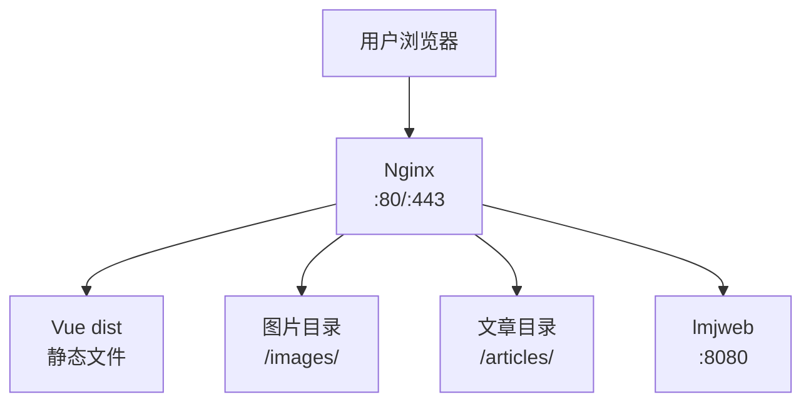

# Vue Blog 架构文档

## 架构概述

本项目采用三层架构设计，实现前后端分离、只读展示的博客系统。



---

## 核心组件

### 1. Nginx（反向代理 + 静态资源服务）

**职责**：
- 反向代理 API 请求到 lmjweb 服务
- 提供静态图片访问（`/img/*`）
- 提供文章内容访问（`/article/*`）
- 托管 Vue 构建产物

**关键配置**：
```nginx
# Vue 前端
location / {
    root /path/to/vue-blog/dist;
    try_files $uri $uri/ /index.html;
}

# API 代理
# 为 /api/batch 单独配置
location /api/batch {
    limit_except GET POST { deny all; }
    proxy_method GET;
    proxy_pass http://10.88.0.1:30000/batch;
    proxy_pass_request_body on;
    proxy_set_header Host $host;
    proxy_set_header X-Real-IP $remote_addr;
    add_header Cache-Control "no-cache, no-store, must-revalidate";
}

# 其他 API 保持只读
location /api/ {
    limit_except GET { deny all; }
    proxy_pass http://10.88.0.1:30000/;
    proxy_set_header Host $host;
    add_header Cache-Control "no-cache, no-store, must-revalidate";
}

# 图片服务
location /img/ {
    alias /path/to/images/;
    expires 30d;
}

# 文章内容服务
location /article/ {
    alias /path/to/articles/;
    default_type text/markdown;
}
```

---

### 2. lmjweb（元数据服务）

**职责**：
- 存储所有元数据（文章、标签、图片信息）
- 提供 RESTful API 供前端查询
- 基于 LMDB 高性能键值存储

**数据结构**：



---

### 3. Vue Blog（前端展示层）

**职责**：
- 展示文章列表和详情
- 标签筛选和搜索
- Markdown 渲染
- 主题切换

**技术栈**：
- Vue 3 (Composition API)
- Vue Router 4
- Vite 构建
- SCSS 样式
- marked + highlight.js + DOMPurify

**目录结构**：
```
src/
├── api/
│   └── lmjweb.js          # lmjweb API 封装
├── config/
│   └── blog.js            # 博客配置（含指针配置）
├── components/
│   ├── BlogCard.vue       # 文章卡片
│   ├── BlogPostView.vue   # 文章内容渲染
│   ├── Header.vue         # 页头
│   ├── Footer.vue         # 页脚
│   ├── Navbar.vue         # 导航栏
│   ├── TagCard.vue        # 标签卡片
│   └── ThemeToggle.vue    # 主题切换
├── views/
│   ├── Home.vue           # 首页
│   ├── Blog.vue           # 文章详情页
│   ├── About.vue          # 关于页
│   └── Error.vue          # 错误页
├── router/
│   └── index.js           # 路由配置
├── styles/
│   ├── variables.css      # CSS 变量
│   ├── themes.js          # 主题配置
│   └── ThemeStore.js      # 主题状态管理
├── App.vue
└── main.js
```

---

### 4. 文件系统（图片和文章存储）

**图片目录** (`/path/to/images/`)：
- 文件名：图片对象指针（34 位十六进制，如 `01img001...`）
- 格式：任意图片格式（JPG/PNG/GIF 等）
- 访问方式：`https://blog.example.com/img/01img001...`

**文章目录** (`/path/to/articles/`)：
- 文件名：文章对象指针（34 位十六进制，如 `01art001...`）
- 格式：Markdown 内容（无扩展名）
- 访问方式：`https://blog.example.com/article/01art001...`

---

## 数据流

### 首页加载流程



### 文章详情加载流程



### 图片加载流程



---

## 内容发布流程



---

## 部署架构

### 开发环境



### 生产环境



---

## 关键设计决策

### 1. 为什么使用指针而不是 ID？

- **全局唯一**：34 位十六进制指针保证全局唯一性
- **类型标识**：前缀 `01` 表示对象，`02` 表示集合
- **防注入**：指针格式固定，避免 SQL 注入等安全问题
- **自包含**：指针本身包含类型信息，无需额外查询

### 2. 为什么图片和文章通过 Nginx 读取而不是 API？

- **性能**：Nginx 直接读文件比 API 转发更高效
- **缓存**：Nginx 可以方便地配置缓存策略
- **解耦**：前端展示层与元数据服务解耦
- **CDN 友好**：静态资源可以方便地接入 CDN

### 3. 为什么文章内容无扩展名？

- **安全**：避免直接暴露文件格式
- **统一**：所有资源通过指针访问，格式透明
- **灵活**：未来可以更改存储格式而不影响访问

### 4. 为什么 Vue 项目是只读的？

- **职责分离**：展示与内容管理分离
- **安全性**：只读前端降低攻击面
- **简化**：前端无需处理上传、鉴权等复杂逻辑

---

## 配置说明

### index.html 中的全局配置

| 配置项 | 类型 | 说明 | 示例 |
|--------|------|------|------|
| `LMJWEB_API` | string | lmjweb 服务地址 | `http://localhost:8080` |
| `BLOG_INFO_PTR` | string | 博客信息对象指针 | `01abc123...` |
| `IMAGE_BASE` | string | 图片访问基础路径 | `/img/` |
| `ARTICLE_BASE` | string | 文章内容访问基础路径 | `/article/` |

---

## 扩展性

### 水平扩展

- **lmjweb**：支持多实例部署，通过负载均衡分发请求
- **Nginx**：支持多节点部署，静态资源可接入 CDN
- **文件系统**：图片/文章目录可挂载分布式存储

### 功能扩展（展示潜力，不考虑实现）

- **评论系统**：可新增评论对象集合，关联文章指针
- **用户系统**：可新增用户对象集合，实现作者关联
- **分类系统**：类似标签系统，增加分类集合

---

## 监控与运维

### 健康检查

```bash
# 检查 lmjweb 服务
curl http://localhost:8080/health

# 检查 Nginx
curl -I http://localhost/

# 检查图片访问
curl -I http://localhost/img/01img...

# 检查文章访问
curl -I http://localhost/article/01art...
```

### 日志位置

- Nginx 日志：`/var/log/nginx/`
- lmjweb 日志：根据 lmjcore 配置
- Vue 错误：浏览器控制台 + 前端监控

---

## 版本历史

| 版本 | 日期 | 变更 |
|------|------|------|
| 1.0.0 | 2026-05-18 | 初始架构：Nginx + lmjweb + Vue Blog |
| 1.1.0 | 2026-05-23 | 使用 Mermaid 图表重构架构图 |
| 1.2.0 | 2026-05-23 | 优化请求：使用 batch + 链式查询减少 HTTP 请求数；移除文章 slug 字段 |